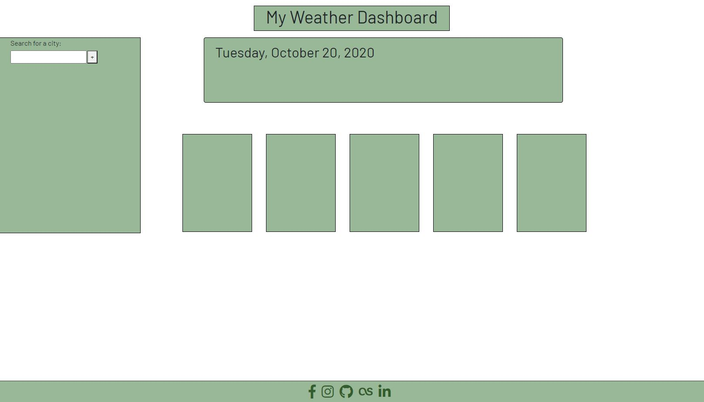

# Weather-Dashboard

<a href="https://ethanrmcdowell.github.io/Weather-Dashboard/">Link to weather dashboard</a>

The goal of this website/app was to create a fully-functional weather dashboard utilizing two different OpenWeather APIs (one for current weather/forecast and another for the UV index). Upon visiting the site for the first time, all the fields will be blank and the only thing you're able to do is search for a city.

Upon entering the name of a valid city and either pressing enter or clicking the + button, all of the fields will populate. You will be able to see the name of the city, the date, current weather, temperature, humidity, wind speed, and UV index. The UV index will be color-coded depending on risk for low, moderate, high, very high, and extreme conditions. Below the current weather, you'll have five boxes showing the five-day forecast. It will provide the same data for each day not including the UV index.

You can also click on any of the last five cities you've searched for, which will be displayed on the sidebar below the search field, and it will automatically populate the page with that city's information. I've also done some basic formatting for mobile and tablet view - each box on the page will take up one row so that it is easily visible and scrollable.

